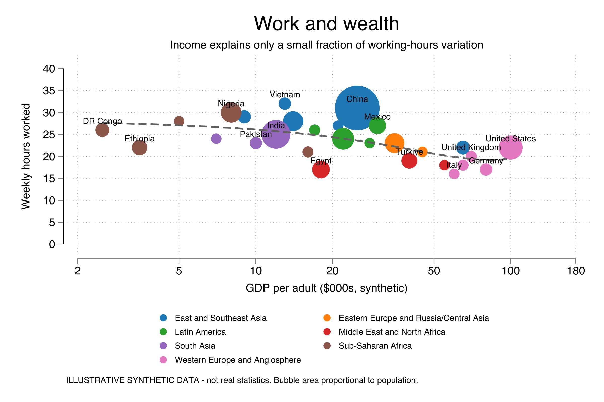
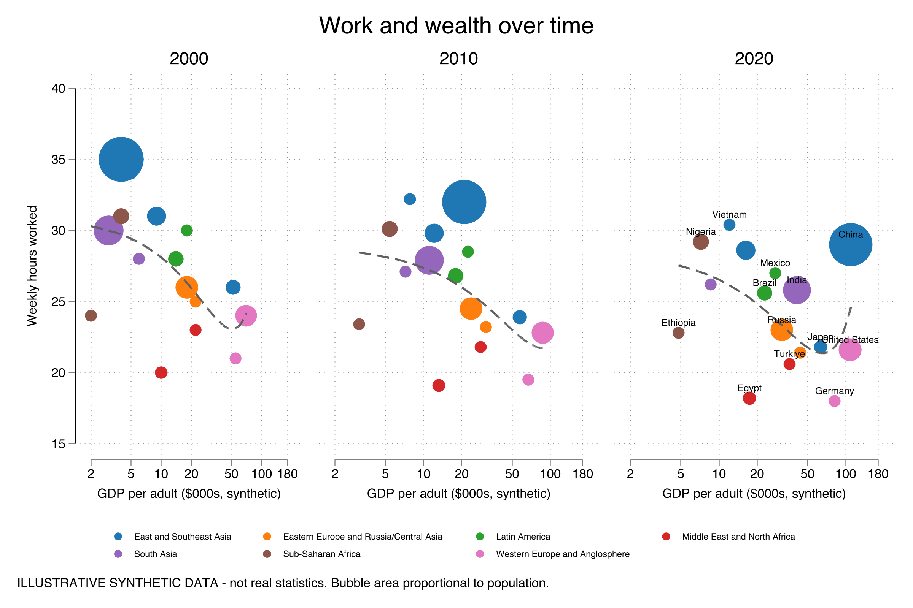

# bubble

A Stata command that draws a **weighted bubble / scatter plot** in the editorial
style of the IMF *Finance & Development* **"Work and wealth"** chart: each point
is a bubble whose **area** is proportional to a size weight (population, GDP,
sales…), **coloured by a group** with a legend, on optional **log axes** with
custom ticks, with **selective labels** on chosen points and a dashed
**quadratic/linear trend line**. A **cross-period small-multiples** mode draws one
panel per period so you can watch entities move over time.

一個 Stata 指令，繪製 IMF《Finance & Development》「Work and wealth」風格的
**加權泡泡圖**：泡泡**面積**正比於權重（人口、GDP、營收…），依**分組著色**並附
圖例，可用**對數軸**與自訂刻度，只標註**選定的點**，並加上虛線**二次／線性趨勢線**。
另有**跨期間小倍數**模式，一期一格，觀察各單位隨時間移動。



> **Data note / 資料說明**：The bundled demo data are **illustrative synthetic
> values**, not real statistics and not copied from any IMF/F&D publication — only
> the chart *type* and *theme* are shared. 內建範例為**合成虛構數據**，非真實統計、
> 未抄錄任何 IMF/F&D 出版品，僅共用圖型與主題。

## Requirements

- Stata 15 or newer.
- SSC packages `schemepack`, `grstyle`, `palettes`, `colrspace`, and `grc1leg2`
  (for panel mode). `bubble` installs any that are missing on first use.

## Installation

### Option A — `net install` (recommended)

```stata
net install bubble, from("https://raw.githubusercontent.com/ganma0517/stata_bubble/main/") replace
```

### Option B — `github install`

```stata
github install ganma0517/stata_bubble
```

After installing, read the help and run the example:

```stata
help bubble
do bubble_example.do
```

## Quick start

A small **synthetic** practice dataset is bundled (no real-world source):
`gdp` (GDP per adult) vs `hours` (weekly hours) for ~28 countries, `pop`
(population) for bubble size and `region` for colour.

```stata
use "https://raw.githubusercontent.com/ganma0517/stata_bubble/main/bubble_demo.dta", clear

* minimal: bubbles sized by pop, coloured by region, log x-axis
bubble hours gdp [aw=pop], by(region) xlog

* full IMF-style chart
bubble hours gdp [aw=pop], by(region) mlabel(country) labelif(labelme) ///
    xlog xlabels(2 5 10 20 50 100 180) trend(qfit) title("Work and wealth")
```

## Cross-period small multiples / 跨期間小倍數

`panel(year)` draws one bubble panel per year and combines them with a single
shared legend. Axes are fixed identical across panels, and an invisible anchor
point keeps **bubble sizes comparable** between panels.

```stata
use "https://raw.githubusercontent.com/ganma0517/stata_bubble/main/bubble_panel_demo.dta", clear

bubble hours gdp [aw=pop], by(region) panel(year) sharey ///
    mlabel(country) labelif(labelme) labelpanel(last)    ///
    xlog xlabels(2 5 10 20 50 100 180) ylabels(15(5)40) yrange(15 40) ///
    trend(qfit) gridcolor(gs9) opacity(35) legcols(4)    ///
    title("Work and wealth over time")
```



## Key options

| Option | What it does |
|---|---|
| `[aw=sizevar]` | bubble **area** proportional to this weight |
| `by(varname)` | colour bubbles by group + legend (string auto-encoded) |
| `mlabel()` `labelif()` | label points; only where the 0/1 indicator is 1 |
| `panel(varname)` | one panel per level — cross-period small multiples |
| `sharey` `labelpanel()` | Y axis on first panel only; which panel is labelled |
| `xlog` `ylog` `xlabels()` `ylabels()` | log axes and custom ticks |
| `xrange()` `yrange()` | fixed axis ranges (shared across panels) |
| `trend(qfit|lfit|none)` | dashed trend line |
| `opacity()` `bubble()` `palette()` `scheme()` `gridcolor()` | styling |
| `title()` `subtitle()` `xtitle()` `ytitle()` `note()` | titles |
| `legcols()` `saving()` `name()` `export()` | legend / output |

See `help bubble` for the full list.

## Bundled examples

- `bubble_example.do` — single chart (minimal and full IMF-style)
- `bubble_panel_example.do` — cross-year small multiples
- `example_bubble.png`, `example_bubble_panel.png`, `example_bubble_minimal.png`

## Also available as a Claude skill

The `claude-skill/` folder packages the same workflow as a Claude (Claude Code)
skill — parametrized `.do` templates plus guidance — for generating these charts
conversationally. It is independent of the `.ado` command.

## License

MIT © 2026 Wen-Cheng Lin. See [LICENSE](LICENSE).
